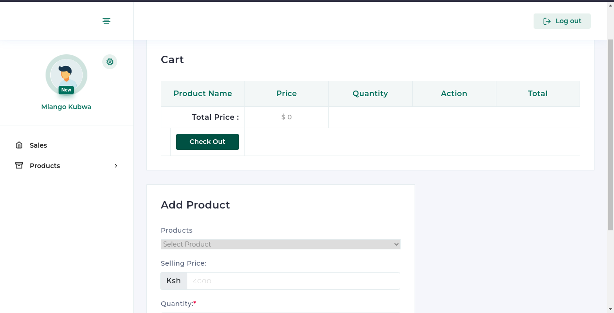
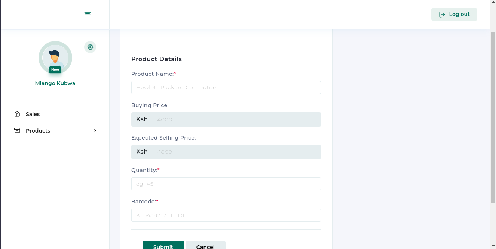
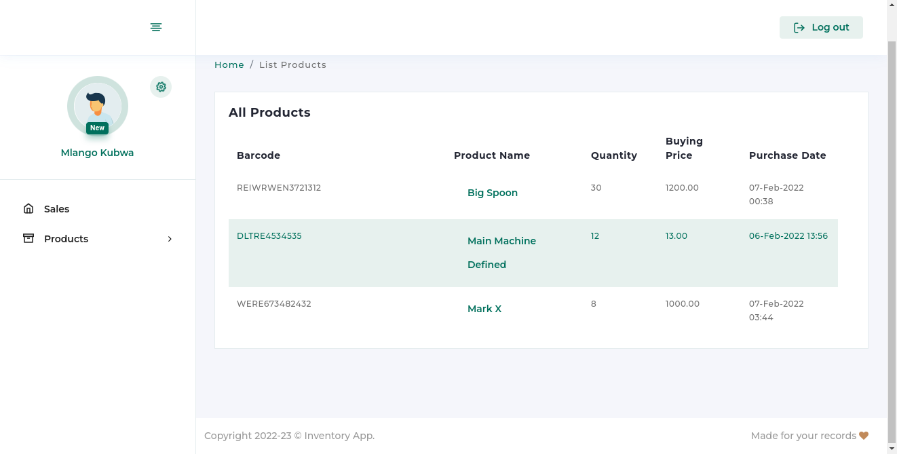
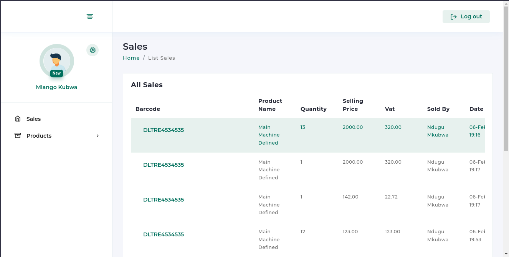

# Inventory Project Interview

A quick development of an Inventory Management System for an interview I did

The user is first presented with a login page as show below

 

 

Upon login the user is presented with the add sale page
 

Add sale page [part B]

All Products Page

All Sales Page

